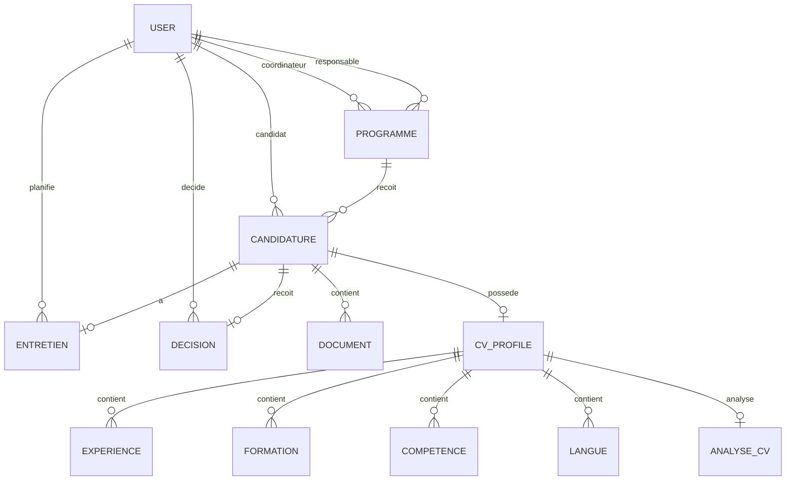

# ExchangeHub — Dossier complet du projet Backend

> Version de référence du backend ExchangeHub.  
> Ce document reprend uniquement le projet principal en **Spring Boot + Supabase + Keycloak**.  
> Toute la partie JEE / WildFly / EJB est volontairement exclue du périmètre.

---

## 1. Vision générale du projet

**ExchangeHub** est une plateforme backend de gestion des candidatures pour des programmes de mobilité internationale.

Le système permet à des candidats de postuler à des programmes, de déposer leurs documents, puis à une équipe interne de suivre les dossiers, analyser les candidatures, planifier des entretiens et prendre une décision finale.

Le projet ressemble à un **ATS simplifié** adapté à la mobilité internationale.

ATS signifie :

```text
Applicant Tracking System
```

C'est un système de suivi de candidatures.

---

## 2. Objectif fonctionnel

Le backend doit gérer :

```text
Programme
  → Candidature
      → Documents
      → Profil CV analysé
      → Entretien
      → Décision finale
```

Le système doit permettre :

- la création et la consultation des programmes ;
- la création d'une candidature par un candidat ;
- l'upload de documents dans Supabase Storage ;
- la génération d'URL signées pour consulter des fichiers privés ;
- la consultation des candidatures avec des règles de sécurité ;
- le changement du statut d'une candidature ;
- l'intégration Keycloak pour l'authentification JWT ;
- la gestion des rôles métier : `CANDIDAT`, `COORDINATEUR`, `RESPONSABLE`, `ADMIN` ;
- plus tard : entretiens, décisions, analyse CV, archivage et workflow strict.

---

## 3. Technologies retenues

### Backend

```text
Java 17
Spring Boot 3.5.x
Spring Web
Spring Data JPA
Spring Security
OAuth2 Resource Server
Validation
Lombok
Flyway
```

### Base de données

```text
PostgreSQL via Supabase
```

### Stockage fichiers

```text
Supabase Storage
Bucket privé : candidature-documents
```

### Authentification

```text
Keycloak
JWT Bearer Token
Realm : exchangehub
Client : exchangehub-backend
```

### Tests API

```text
Postman
```

---

## 4. Architecture globale

Architecture backend classique et propre :

```text
Controller
   ↓
DTO
   ↓
Service
   ↓
Repository
   ↓
Database / Storage
```

### Rôle de chaque couche

| Couche | Rôle |
|---|---|
| Controller | Reçoit les requêtes HTTP |
| DTO | Définit les données d'entrée/sortie API |
| Service | Contient la logique métier |
| Repository | Accède à PostgreSQL via JPA |
| Entity | Représente les tables en base |
| SecurityConfig | Sécurise les routes avec Keycloak |
| CurrentUserService | Récupère l'utilisateur connecté depuis le JWT |
| SupabaseStorageService | Communique avec Supabase Storage |

---

## 5. Décisions techniques importantes

### 5.1 PostgreSQL est la source de vérité

La base est créée avec Flyway.

Spring Boot ne doit pas créer automatiquement les tables en production.

Configuration recommandée :

```properties
spring.jpa.hibernate.ddl-auto=validate
```

Flyway est responsable de créer et versionner le schéma.

---

### 5.2 Les fichiers ne sont pas stockés dans PostgreSQL

Les documents comme CV, relevés de notes ou passeports ne doivent pas être stockés en base.

Bonne architecture :

```text
Supabase Storage → fichier réel
PostgreSQL       → métadonnées du fichier
```

Exemple :

```text
Supabase Storage:
candidature-documents/candidatures/{candidatureId}/{uuid}_cv.pdf

PostgreSQL table document:
- file_name
- file_url
- storage_path
- mime_type
- size
```

---

### 5.3 Le bucket Supabase reste privé

Le bucket `candidature-documents` doit rester privé.

Pourquoi ?

Parce qu'il contient des données personnelles :

- CV ;
- relevés de notes ;
- passeports ;
- documents administratifs.

Pour consulter un fichier, le backend génère une **URL signée temporaire**.

---

### 5.4 UUID au lieu d'auto-increment

Les identifiants sont en `UUID`.

Exemple :

```text
550e8400-e29b-41d4-a716-446655440000
```

Avantages :

- identifiants non prédictibles ;
- meilleure sécurité ;
- compatible architecture distribuée ;
- adapté aux APIs modernes.

Dans le projet actuel, les UUID sont générés côté backend avec :

```java
UUID.randomUUID()
```

---

### 5.5 DTO obligatoire

Le backend ne doit pas exposer directement les entités JPA comme corps de requête.

Mauvaise approche :

```text
Controller reçoit directement Candidature
```

Bonne approche :

```text
Controller reçoit CreateCandidatureRequest
Service crée une vraie Candidature
```

Pourquoi ?

- meilleure sécurité ;
- meilleure lisibilité ;
- séparation API / DB ;
- évite que le client modifie des champs sensibles comme `statut`, `archivedAt`, etc.

---

### 5.6 Keycloak remplace le header temporaire X-USER-ID

Pendant le développement, l'utilisateur connecté était simulé avec :

```text
X-USER-ID
```

Ce mécanisme est maintenant remplacé par Keycloak.

Aujourd'hui, l'utilisateur est récupéré depuis :

```text
Authorization: Bearer <access_token>
```

Le backend lit le JWT, récupère l'email, puis retrouve l'utilisateur dans la table `users`.

---

## 6. Rôles métier

### 6.1 CANDIDAT

Le candidat est l'utilisateur qui postule à un programme.

Il peut :

- créer une candidature ;
- consulter uniquement ses propres candidatures ;
- uploader ses propres documents ;
- consulter ses propres documents ;
- récupérer une URL signée pour ses documents ;
- voir le statut de son dossier.

Il ne peut pas :

- voir les candidatures des autres ;
- changer le statut d'une candidature ;
- planifier un entretien ;
- prendre une décision finale.

---

### 6.2 COORDINATEUR

Le coordinateur est responsable du suivi opérationnel des dossiers.

Il peut :

- voir les candidatures ;
- suivre les dossiers ;
- changer certains statuts ;
- planifier les entretiens ;
- consulter les documents ;
- uploader des documents si nécessaire.

Il ne doit pas :

- prendre une décision finale d'acceptation ou de refus.

Résumé :

```text
Coordinateur = gestion opérationnelle
```

---

### 6.3 RESPONSABLE

Le responsable est le rôle décisionnel.

Il peut :

- consulter les candidatures ;
- consulter les documents ;
- consulter les entretiens ;
- prendre la décision finale : `ACCEPTEE`, `REFUSEE`, `LISTE_ATTENTE` ;
- modifier les statuts avancés.

Il ne s'occupe pas forcément de la planification quotidienne.

Résumé :

```text
Responsable = décideur final
```

---

### 6.4 ADMIN

L'administrateur est le super-utilisateur technique et fonctionnel.

Il peut :

- tout voir ;
- tout modifier ;
- gérer les programmes ;
- corriger les données ;
- aider au support ;
- intervenir en cas de problème.

Résumé :

```text
Admin = accès total
```

---

## 7. Entités du domaine

### 7.1 User

Représente un utilisateur applicatif.

Un utilisateur peut être :

- candidat ;
- coordinateur ;
- responsable ;
- admin.

Champs :

```text
id
keycloakId
nom
prenom
email
role
actif
createdAt
updatedAt
```

Contraintes :

```text
email unique
keycloakId unique
role obligatoire
```

Remarque importante :

On ne crée pas des tables séparées `candidat`, `coordinateur`, `responsable`, `admin`.

Ces notions sont des rôles, donc elles restent dans `User.role`.

---

### 7.2 Programme

Représente un programme de mobilité.

Exemples :

- Programme Erasmus Espagne ;
- Stage Allemagne ;
- Formation France ;
- Enseignement Canada.

Champs :

```text
id
titre
description
typeMobilite
pays
universitePartenaire
dateDebut
dateFin
dateLimiteCandidature
statut
coordinateur
responsable
createdAt
updatedAt
```

Relations :

```text
Programme 1 → 0..* Candidature
User 1 → 0..* Programme comme coordinateur
User 1 → 0..* Programme comme responsable
```

Contraintes métier :

```text
coordinateur.role = COORDINATEUR
responsable.role = RESPONSABLE
dateLimiteCandidature avant dateDebut
```

---

### 7.3 Candidature

Entité centrale du système.

Une candidature représente le dossier d'un candidat pour un programme donné.

Champs :

```text
id
candidat
programme
statut
submittedAt
archivedAt
archivedBy
createdAt
updatedAt
```

Relations :

```text
User 1 → 0..* Candidature comme candidat
Programme 1 → 0..* Candidature
Candidature 1 → 1..* Document
Candidature 1 → 0..1 CvProfile
Candidature 1 → 0..1 Entretien
Candidature 1 → 0..1 Decision
```

Contraintes :

```sql
UNIQUE (candidat_id, programme_id)
```

Cela signifie :

```text
Un candidat peut postuler à plusieurs programmes,
mais une seule fois au même programme.
```

Archivage :

```text
Pas de suppression physique d'une candidature.
On archive avec archivedAt et archivedBy.
```

---

### 7.4 Document

Représente un document uploadé pour une candidature.

Champs :

```text
id
candidature
typeDocument
fileName
fileUrl
storagePath
mimeType
size
uploadedAt
```

Relations :

```text
Candidature 1 → 1..* Document
Document * → 1 Candidature
```

Types possibles :

```text
CV
RELEVE_NOTES
LETTRE_MOTIVATION
PASSEPORT
AUTRE
```

Règles métier prévues :

```text
Toute candidature doit avoir au minimum un CV.
Si typeMobilite = ETUDES → CV + RELEVE_NOTES obligatoires.
Si typeMobilite = ENSEIGNEMENT → CV obligatoire.
Si typeMobilite = FORMATION → CV obligatoire.
```

---

### 7.5 CvProfile

Représente le CV standardisé après parsing ou analyse.

Champs :

```text
id
candidature
nomComplet
email
telephone
titreProfil
resume
anneesExperience
parsedAt
```

Relation :

```text
Candidature 1 → 0..1 CvProfile
```

Pourquoi `0..1` ?

Parce qu'une candidature peut exister avant que le CV soit analysé.

Contrainte :

```sql
UNIQUE (candidature_id)
```

---

### 7.6 Experience

Représente une expérience extraite du CV.

Champs :

```text
id
cvProfile
poste
organisation
pays
dateDebut
dateFin
description
current
```

Relation :

```text
CvProfile 1 → 0..* Experience
```

---

### 7.7 Formation

Représente une formation académique extraite du CV.

Champs :

```text
id
cvProfile
diplome
etablissement
pays
domaine
dateDebut
dateFin
```

Relation :

```text
CvProfile 1 → 0..* Formation
```

---

### 7.8 Competence

Représente une compétence extraite du CV.

Champs :

```text
id
cvProfile
nom
niveau
```

Relation :

```text
CvProfile 1 → 0..* Competence
```

---

### 7.9 Langue

Représente une langue maîtrisée par le candidat.

Champs :

```text
id
cvProfile
langue
niveau
```

Relation :

```text
CvProfile 1 → 0..* Langue
```

---

### 7.10 AnalyseCv

Représente l'analyse automatique ou semi-automatique du CV.

Champs :

```text
id
cvProfile
scoreGlobal
scoreExperience
scoreFormation
scoreLangues
scoreCompetences
pointsForts
pointsFaibles
recommandation
analyzedAt
```

Relation :

```text
CvProfile 1 → 0..1 AnalyseCv
```

Contraintes :

```text
Chaque score doit être entre 0 et 100.
Un CvProfile a au maximum une AnalyseCv.
```

---

### 7.11 Entretien

Représente l'entretien associé à une candidature.

Champs :

```text
id
candidature
dateEntretien
mode
lienVisio
lieu
statut
planifiePar
notes
createdAt
updatedAt
```

Relation :

```text
Candidature 1 → 0..1 Entretien
```

Décision importante :

On garde `0..1 Entretien`, même si dans certains systèmes il pourrait y avoir plusieurs entretiens.

Règles :

```text
Une candidature peut avoir aucun ou un seul entretien.
Si mode = VISIO → lienVisio obligatoire.
Si mode = PRESENTIEL → lieu obligatoire.
planifiePar.role = COORDINATEUR.
```

---

### 7.12 Decision

Représente la décision finale sur une candidature.

Champs :

```text
id
candidature
decision
responsable
commentaire
decidedAt
```

Relation :

```text
Candidature 1 → 0..1 Decision
```

Décision importante :

On garde `0..1 Decision`.

Règles :

```text
Une candidature peut avoir une seule décision finale.
responsable.role = RESPONSABLE.
```

---

## 8. Relations UML principales

```text
User
 ├── 0..* Candidature comme candidat
 ├── 0..* Programme comme coordinateur
 ├── 0..* Programme comme responsable
 ├── 0..* Entretien comme planificateur
 └── 0..* Decision comme décideur

Programme
 └── 0..* Candidature

Candidature
 ├── 1..* Document
 ├── 0..1 CvProfile
 ├── 0..1 Entretien
 └── 0..1 Decision

CvProfile
 ├── 0..* Experience
 ├── 0..* Formation
 ├── 0..* Competence
 ├── 0..* Langue
 └── 0..1 AnalyseCv
```

---

## 9. Diagramme Mermaid



---

## 10. Enums du projet

### Role

```text
CANDIDAT
COORDINATEUR
RESPONSABLE
ADMIN
```

### TypeMobilite

```text
ETUDES
ENSEIGNEMENT
FORMATION
```

### StatutProgramme

```text
BROUILLON
OUVERT
FERME
ARCHIVE
```

### StatutCandidature

```text
BROUILLON
SOUMISE
EN_ANALYSE
ANALYSEE
ENTRETIEN_PLANIFIE
ENTRETIEN_TERMINE
ACCEPTEE
REFUSEE
ANNULEE
```

### TypeDocument

```text
CV
RELEVE_NOTES
LETTRE_MOTIVATION
PASSEPORT
AUTRE
```

### NiveauCompetence

```text
DEBUTANT
INTERMEDIAIRE
AVANCE
EXPERT
```

### NiveauLangue

```text
A1
A2
B1
B2
C1
C2
NATIVE
```

### ModeEntretien

```text
VISIO
PRESENTIEL
TELEPHONE
```

### StatutEntretien

```text
PLANIFIE
TERMINE
ANNULE
ABSENT
```

### DecisionFinale

```text
ACCEPTEE
REFUSEE
LISTE_ATTENTE
```

---

## 11. Base de données et migrations Flyway

Les migrations créées jusqu'ici :

```text
V1__init_schema.sql
V2__add_document_cv.sql
V3__add_cv_details.sql
V4__add_analysis_interview_decision.sql
```

### V1 — Schéma initial

Tables :

```text
users
programme
candidature
```

Relations :

```text
candidature.candidat_id → users.id
candidature.programme_id → programme.id
programme.coordinateur_id → users.id
programme.responsable_id → users.id
```

Contrainte :

```sql
UNIQUE (candidat_id, programme_id)
```

---

### V2 — Documents et profil CV

Tables :

```text
document
cv_profile
```

Relations :

```text
document.candidature_id → candidature.id
cv_profile.candidature_id → candidature.id
```

Contrainte :

```sql
UNIQUE (candidature_id)
```

sur `cv_profile`.

---

### V3 — Détails CV

Tables :

```text
experience
formation
competence
langue
```

Toutes liées à :

```text
cv_profile.id
```

---

### V4 — Analyse, entretien, décision

Tables :

```text
analyse_cv
entretien
decision
```

Contraintes importantes :

```sql
UNIQUE (cv_profile_id)
UNIQUE (candidature_id) -- entretien
UNIQUE (candidature_id) -- decision
```

Scores `analyse_cv` entre 0 et 100.

---

## 12. Configuration Supabase

### Database

Connexion PostgreSQL via Supabase pooler.

Exemple de configuration sans secret :

```properties
spring.datasource.url=jdbc:postgresql://<host-supabase-pooler>:5432/postgres
spring.datasource.username=<username-supabase>
spring.datasource.password=<password-supabase>
```

Ne jamais versionner le mot de passe.

---

### Storage

Bucket :

```text
candidature-documents
```

Propriétés :

```properties
supabase.url=https://<project-ref>.supabase.co
supabase.service-role-key=<SERVICE_ROLE_KEY>
supabase.storage.bucket=candidature-documents
```

Attention :

```text
service-role-key = backend uniquement
jamais frontend
jamais GitHub
```

---

## 13. Configuration Keycloak

### Realm

```text
exchangehub
```

### Client

```text
exchangehub-backend
```

Configuration client utilisée :

```text
Client type: OpenID Connect
Client authentication: OFF
Authorization: OFF
Standard flow: ON
Direct access grants: ON
```

### Rôles Realm

```text
CANDIDAT
COORDINATEUR
RESPONSABLE
ADMIN
```

### Token

Obtention d'un token via Postman :

```text
POST http://[::1]:8080/realms/exchangehub/protocol/openid-connect/token
```

Body `x-www-form-urlencoded` :

```text
grant_type=password
client_id=exchangehub-backend
username=jean
password=password
```

Utilisation dans le backend :

```text
Authorization: Bearer <access_token>
```

### Configuration Spring Security

```properties
spring.security.oauth2.resourceserver.jwt.issuer-uri=http://[::1]:8080/realms/exchangehub
spring.security.oauth2.resourceserver.jwt.jwk-set-uri=http://[::1]:8080/realms/exchangehub/protocol/openid-connect/certs
```

Remarque :

Le projet utilise `[::1]` car Keycloak tourne en Docker et cette URL fonctionnait dans l'environnement local.

---

## 14. Récupération de l'utilisateur connecté

L'ancien système :

```text
X-USER-ID
```

est abandonné.

Le système actuel :

```text
JWT Keycloak → email → users.email → User
```

`CurrentUserService` doit :

1. récupérer l'`Authentication` depuis `SecurityContextHolder` ;
2. vérifier que le principal est un `Jwt` ;
3. récupérer le claim `email` ;
4. chercher `User` en base par email ;
5. retourner l'utilisateur applicatif.

Donc il faut que l'email Keycloak soit identique à l'email dans la table `users`.

---

## 15. Sécurité actuelle

### Règle importante

La sécurité se fait à deux niveaux :

```text
SecurityConfig → sécurité générale par rôle
Service        → sécurité métier fine
```

### Exemple

Dans `SecurityConfig`, un `CANDIDAT` peut appeler :

```text
GET /candidatures/{id}
```

Mais dans le service, on vérifie :

```text
candidature.candidat.id == currentUser.id
```

Donc un candidat ne peut pas voir les candidatures d'un autre candidat.

---

## 16. APIs déjà construites

### 16.1 Créer une candidature

```http
POST /candidatures
```

Body :

```json
{
  "programmeId": "uuid-programme"
}
```

Utilisateur :

```text
CANDIDAT uniquement
```

Le candidat est récupéré depuis le token JWT.

Règles :

```text
- user.role doit être CANDIDAT
- programme doit exister
- pas de doublon candidat/programme
- statut initial = SOUMISE
```

---

### 16.2 Lister les candidatures

```http
GET /candidatures
```

Query params optionnels :

```text
statut
programmeId
candidatId
```

Règles :

```text
CANDIDAT → voit uniquement ses candidatures
COORDINATEUR → peut voir plus largement
RESPONSABLE → peut voir plus largement
ADMIN → peut tout voir
```

---

### 16.3 Détail d'une candidature

```http
GET /candidatures/{id}
```

Réponse typique :

```json
{
  "id": "uuid",
  "statut": "SOUMISE",
  "submittedAt": "date",
  "programmeId": "uuid",
  "programmeTitre": "Programme Erasmus Espagne",
  "programmePays": "Espagne",
  "documents": []
}
```

Règle :

```text
Un candidat ne peut voir que sa propre candidature.
```

---

### 16.4 Changer le statut d'une candidature

```http
PATCH /candidatures/{id}/statut
```

Body :

```json
{
  "statut": "EN_ANALYSE"
}
```

Rôles autorisés :

```text
COORDINATEUR
RESPONSABLE
ADMIN
```

Rôle interdit :

```text
CANDIDAT
```

---

### 16.5 Upload document

```http
POST /documents/upload
```

Body `multipart/form-data` :

```text
candidatureId : UUID
typeDocument  : CV
file          : fichier PDF/image
```

Flux :

```text
Postman/Frontend
  → Spring Boot
    → Supabase Storage
      → PostgreSQL document
```

Règles :

```text
- un candidat ne peut uploader que sur sa candidature
- responsable ne devrait pas uploader
- coordinateur/admin peuvent uploader si besoin
```

---

### 16.6 Générer URL signée

```http
GET /documents/{documentId}/signed-url
```

Réponse :

```json
{
  "documentId": "uuid",
  "signedUrl": "https://...",
  "expiresIn": 300
}
```

Objectif :

```text
Permettre d'ouvrir un fichier privé pendant 5 minutes.
```

---

### 16.7 Lister les documents d'une candidature

```http
GET /candidatures/{candidatureId}/documents
```

Règle :

```text
Un candidat ne peut voir que les documents de ses propres candidatures.
```

---

## 17. Services principaux

### CandidatureService

Responsabilités :

```text
- créer candidature
- lister candidatures
- récupérer détail candidature
- changer statut
- appliquer sécurité métier candidat
```

### DocumentService

Responsabilités :

```text
- upload document
- enregistrer métadonnées
- lister documents
- générer URL signée
- vérifier accès candidat/document
```

### SupabaseStorageService

Responsabilités :

```text
- envoyer fichier à Supabase Storage
- créer URL signée
- gérer appels HTTP vers Supabase
```

### CurrentUserService

Responsabilités :

```text
- récupérer JWT courant
- extraire email
- retrouver User en base
```

---

## 18. Workflow candidature prévu

Workflow cible :

```text
SOUMISE
  → EN_ANALYSE
  → ANALYSEE
  → ENTRETIEN_PLANIFIE
  → ENTRETIEN_TERMINE
  → ACCEPTEE / REFUSEE
```

Pour l'instant, le changement de statut existe, mais les transitions strictes ne sont pas encore complètement imposées.

À faire plus tard :

```text
Interdire les transitions invalides.
```

Exemples de transitions invalides :

```text
SOUMISE → ACCEPTEE directement
REFUSEE → EN_ANALYSE
ACCEPTEE → ENTRETIEN_PLANIFIE
```

---

## 19. État actuel du projet

### Terminé

```text
✔ Projet Spring Boot créé
✔ Connexion Supabase PostgreSQL
✔ Bucket Supabase Storage privé
✔ Flyway configuré
✔ Tables principales créées
✔ Entités JPA créées
✔ Repositories créés
✔ Enums créés et branchés
✔ Création candidature
✔ Upload document
✔ URL signée
✔ Liste documents
✔ Détail candidature
✔ Changement statut
✔ Liste candidatures avec filtres
✔ Keycloak realm/client/rôles/users
✔ JWT validé côté Spring Boot
✔ Utilisateur récupéré depuis token
✔ Sécurité métier candidat
```

---

## 20. Ce qu'il reste à faire

Ordre recommandé :

```text
1. Module Programmes
2. Module Entretiens
3. Module Décisions
4. Workflow strict
5. Archivage
6. Validation documents obligatoires
7. Analyse CV / n8n
8. Gestion propre des erreurs
9. Swagger / OpenAPI
10. Tests
```

---

## 21. Module Programmes à faire

Endpoints proposés :

```http
POST   /programmes
GET    /programmes
GET    /programmes/{id}
PATCH  /programmes/{id}
```

Règles :

```text
CANDIDAT → lecture seulement
COORDINATEUR → lecture, éventuellement programmes assignés
RESPONSABLE → création/modification possible selon décision métier
ADMIN → tout
```

Questions à valider :

```text
Est-ce que le coordinateur peut créer un programme ?
Est-ce que seul l'admin crée les programmes ?
Est-ce que le responsable valide l'ouverture d'un programme ?
```

---

## 22. Module Entretiens à faire

Endpoints proposés :

```http
POST   /entretiens
GET    /entretiens/{id}
GET    /candidatures/{id}/entretien
PATCH  /entretiens/{id}/statut
```

Règles :

```text
COORDINATEUR / ADMIN → planifier
CANDIDAT → consulter uniquement son entretien
RESPONSABLE → consulter
```

Contraintes :

```text
Une candidature a au maximum un entretien.
Si mode = VISIO → lienVisio obligatoire.
Si mode = PRESENTIEL → lieu obligatoire.
```

Effet métier possible :

```text
Créer entretien → statut candidature = ENTRETIEN_PLANIFIE
Terminer entretien → statut candidature = ENTRETIEN_TERMINE
```

---

## 23. Module Décisions à faire

Endpoints proposés :

```http
POST /decisions
GET  /candidatures/{id}/decision
```

Règles :

```text
RESPONSABLE / ADMIN → créer décision
CANDIDAT → consulter sa décision
COORDINATEUR → consulter mais ne pas décider
```

Contraintes :

```text
Une candidature a au maximum une décision.
Décision possible : ACCEPTEE / REFUSEE / LISTE_ATTENTE.
Créer décision met à jour statut candidature.
```

---

## 24. Archivage à faire

Principe validé :

```text
On ne supprime pas physiquement une candidature.
On l'archive.
```

Champs déjà prévus :

```text
archivedAt
archivedBy
```

Endpoint proposé :

```http
PATCH /candidatures/{id}/archive
```

Règles :

```text
ADMIN / COORDINATEUR / RESPONSABLE peuvent archiver selon politique.
CANDIDAT ne peut pas archiver directement sauf si on décide d'autoriser l'annulation.
```

Par défaut :

```text
Les candidatures archivées ne doivent pas apparaître dans les listes.
```

---

## 25. Validation documents à faire

Règles prévues :

```text
CV obligatoire pour toute candidature.
ETUDES → CV + RELEVE_NOTES.
ENSEIGNEMENT → CV.
FORMATION → CV.
```

Moment possible de validation :

```text
- lors de la soumission ;
- ou avant passage EN_ANALYSE ;
- ou avant analyse CV.
```

Décision recommandée :

```text
Valider avant passage EN_ANALYSE.
```

---

## 26. Analyse CV / n8n à faire

Idée prévue :

```text
CV uploadé
  → webhook n8n
    → parsing CV
      → création CvProfile
        → création Experience / Formation / Competence / Langue
          → création AnalyseCv
```

Endpoints possibles :

```http
POST /cv-profiles
GET  /candidatures/{id}/cv-profile
POST /analyse-cv
GET  /candidatures/{id}/analyse
```

Plus tard, l'intégration peut être automatisée avec n8n.

---

## 27. Gestion propre des erreurs à faire

Aujourd'hui, certaines erreurs métier retournent encore :

```text
500 Internal Server Error
```

Ce n'est pas propre.

Il faut transformer :

```text
Ressource introuvable → 404
Accès refusé métier   → 403
Requête invalide      → 400
Doublon candidature   → 409
Erreur serveur réelle → 500
```

À créer :

```text
ResourceNotFoundException
BadRequestException
ForbiddenException
ConflictException
GlobalExceptionHandler
ErrorResponse DTO
```

---

## 28. Swagger / OpenAPI à faire

But :

```text
Avoir une documentation interactive de l'API.
```

Dépendance possible :

```text
springdoc-openapi-starter-webmvc-ui
```

URL attendue :

```text
/swagger-ui.html
```

---

## 29. Tests à faire

### Tests Postman

À créer :

```text
Collection ExchangeHub
Environment local
Tokens Keycloak
Tests par rôle
```

### Tests à couvrir

```text
CANDIDAT ne voit que ses candidatures
CANDIDAT ne peut pas changer statut
COORDINATEUR peut changer statut
RESPONSABLE peut décider
ADMIN peut tout faire
Upload document OK
URL signée OK
Doublon candidature refusé
```

---

## 30. Questions ouvertes à valider

Ces questions ne bloquent pas le projet, mais doivent être validées avant la version finale.

### Programmes

```text
Qui peut créer un programme ?
ADMIN seulement ?
RESPONSABLE aussi ?
COORDINATEUR aussi ?
```

### Entretiens

```text
Le RESPONSABLE peut-il planifier un entretien ou seulement le consulter ?
Un entretien peut-il être reprogrammé ?
```

### Décisions

```text
Une décision LISTE_ATTENTE peut-elle devenir ACCEPTEE plus tard ?
Une décision peut-elle être modifiée après validation ?
```

### Workflow

```text
Est-ce que ACCEPTEE / REFUSEE bloquent totalement la candidature ?
Peut-on revenir d'un statut avancé à un statut précédent ?
```

### Documents

```text
La lettre de motivation est-elle obligatoire ?
Le passeport est-il obligatoire pour certains pays ?
```

### Analyse CV

```text
L'analyse CV est-elle automatique dès upload du CV ?
Ou déclenchée par un coordinateur ?
```

---

## 31. Roadmap recommandée

Ordre idéal pour continuer :

```text
Étape 1  → Module Programmes
Étape 2  → Module Entretiens
Étape 3  → Module Décisions
Étape 4  → Workflow strict
Étape 5  → Archivage
Étape 6  → Validation documents
Étape 7  → Analyse CV / n8n
Étape 8  → Gestion erreurs propre
Étape 9  → Swagger
Étape 10 → Tests finaux
```

---

## 32. Résumé final

ExchangeHub est maintenant un backend Spring Boot solide avec :

```text
- PostgreSQL Supabase
- Storage privé Supabase
- Authentification Keycloak JWT
- Rôles métier
- Candidatures sécurisées
- Upload de documents
- URL signées
- Architecture propre Controller / DTO / Service / Repository
```

Le socle technique est terminé.

La suite consiste à terminer les modules métier :

```text
Programme
Entretien
Décision
Workflow
Archivage
Analyse CV
```

